# Car Sales Management System 🚗
This repo was created as a way in accordance to Enterprise Programming group project

## Features
* Add, Edit, and Delete car records.
* Track sales transactions.
* Generate reports.

## Screenshots
### Login
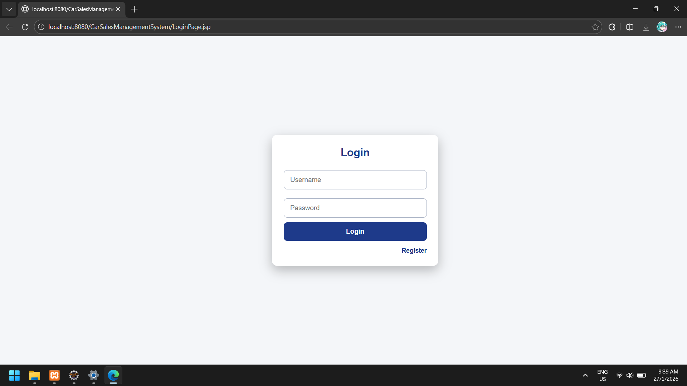
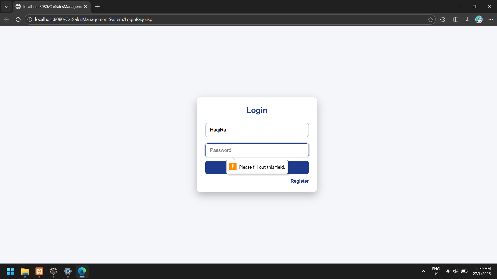
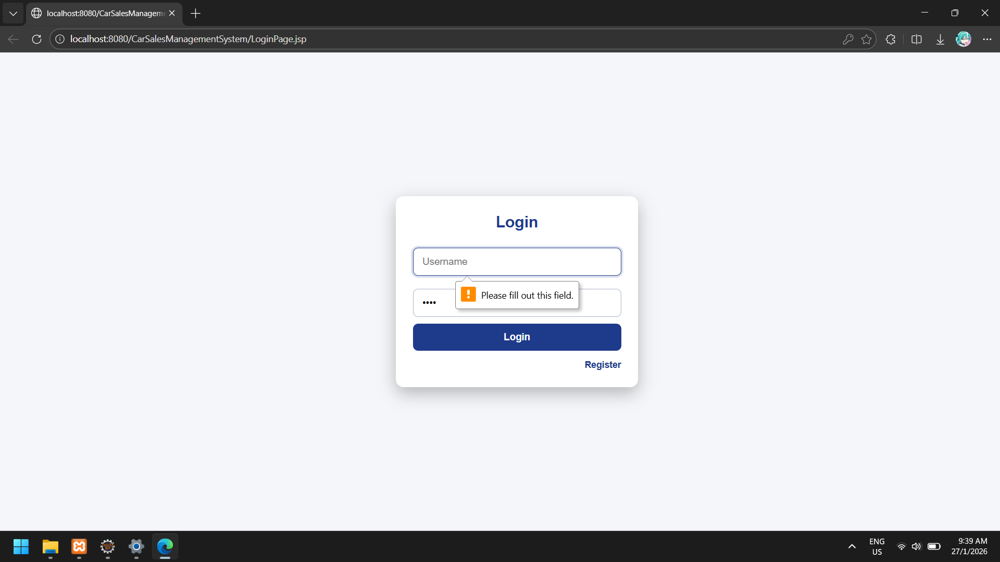

### Dashboard
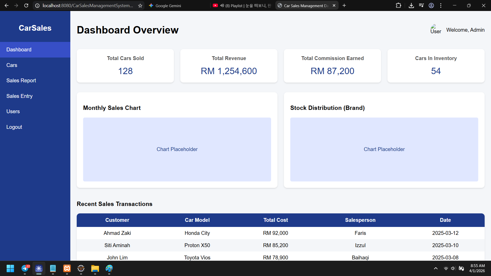

### Cars
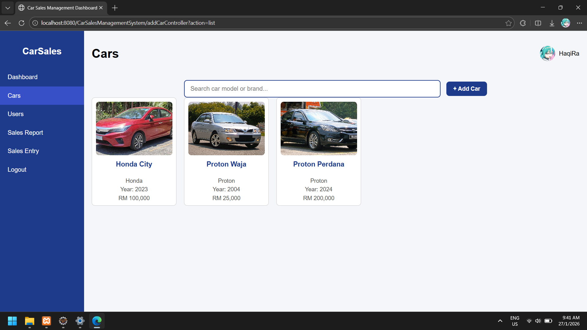

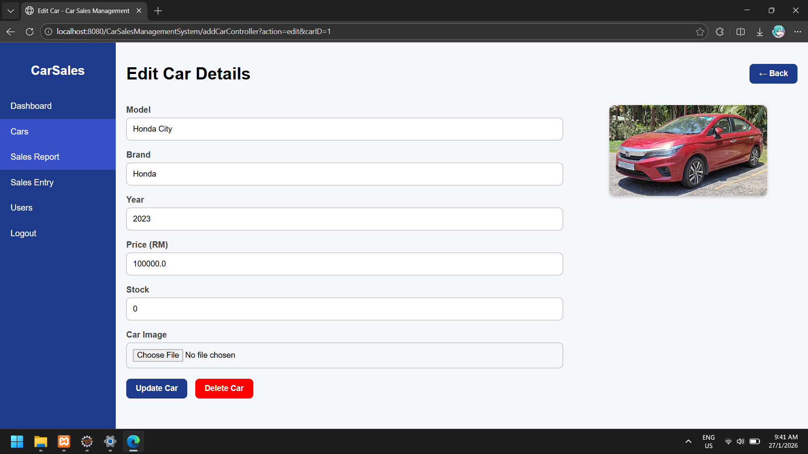
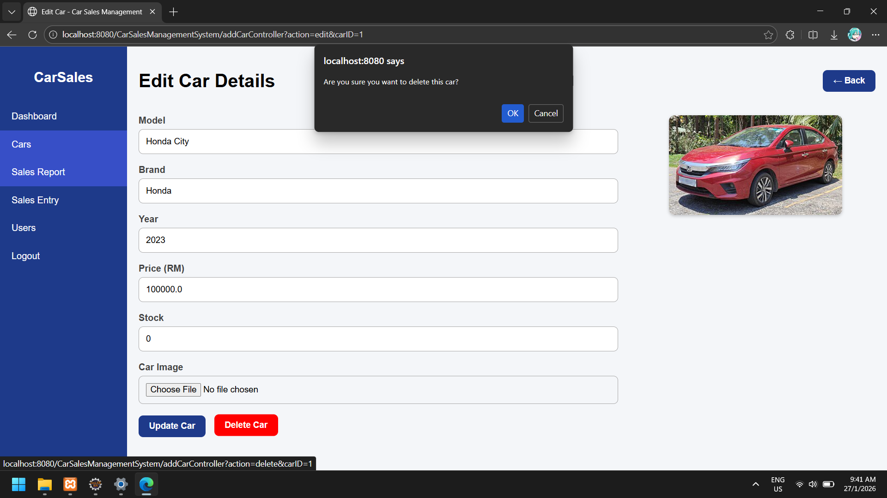

### Sales Entry
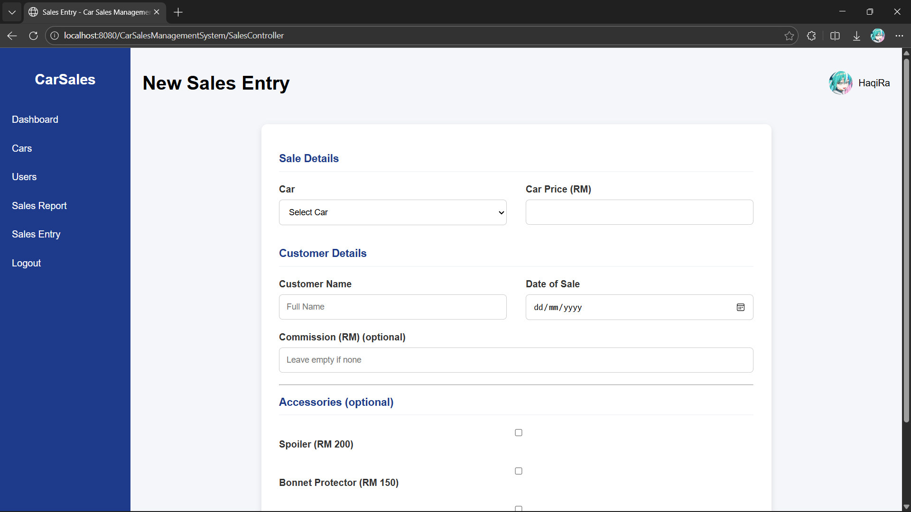
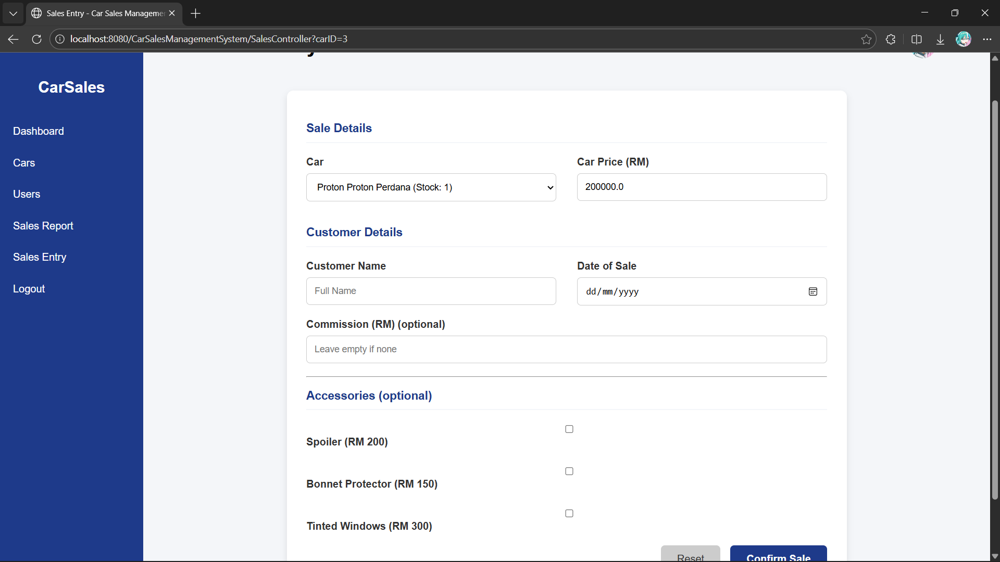

### Sales Report
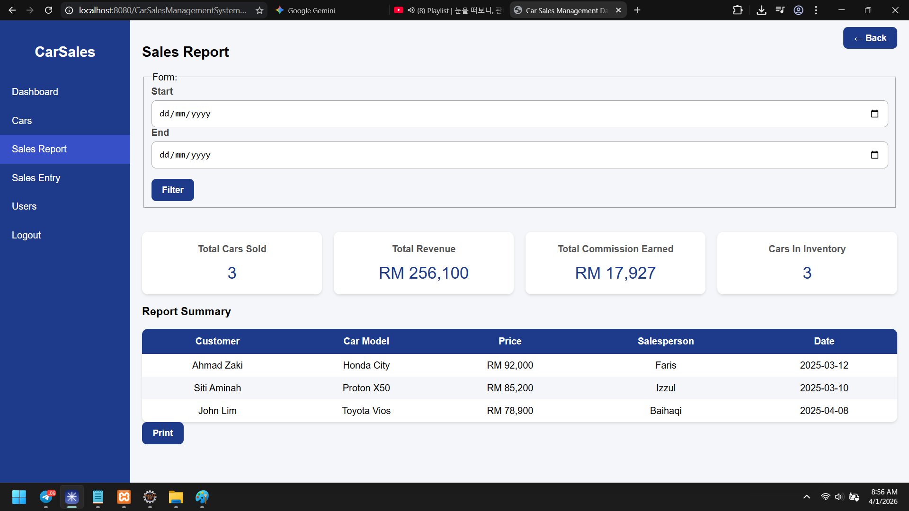
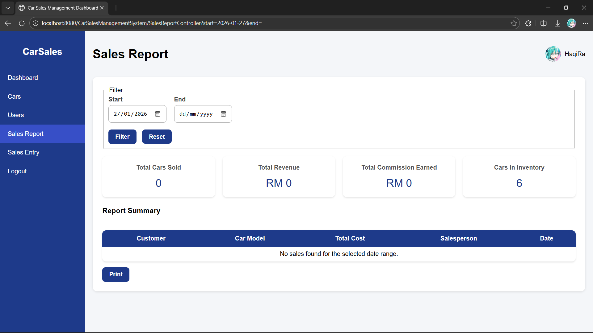
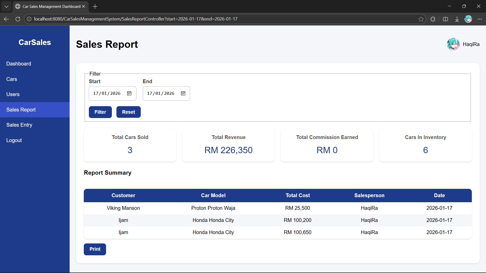

### User Section
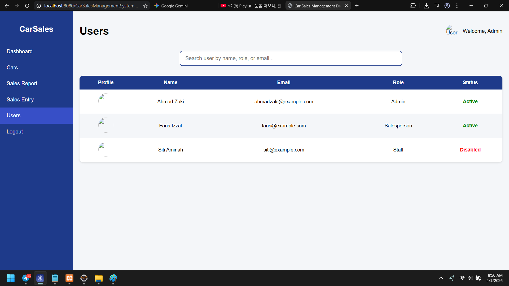
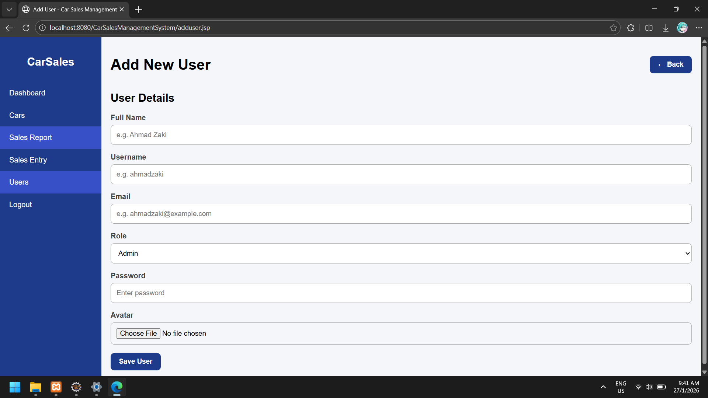
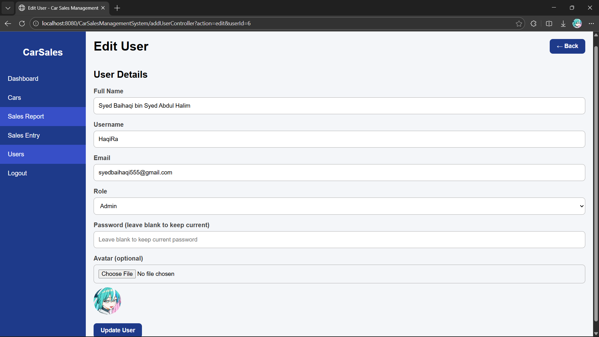
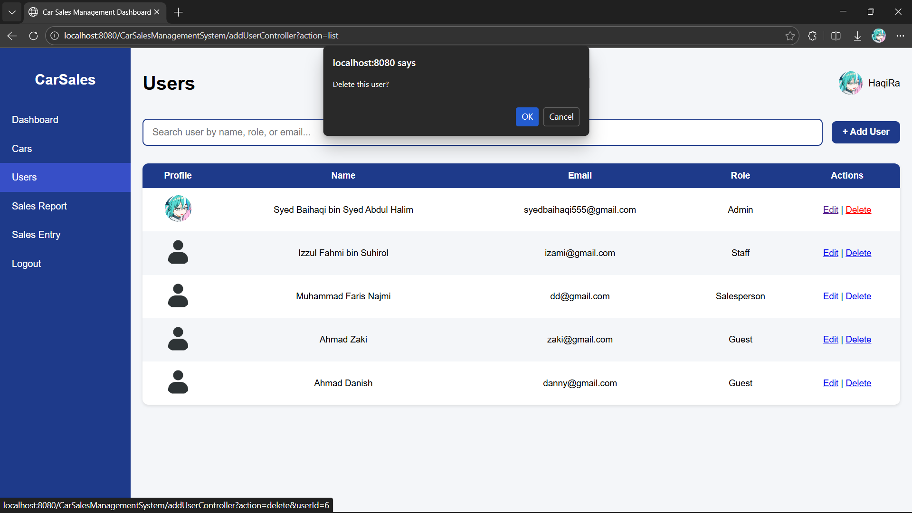